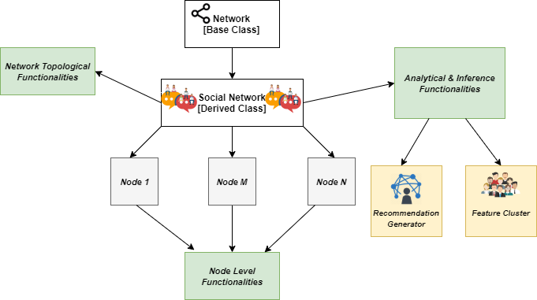

# Scala Social Network Implementation and Statistical Inference(Recommendation Generator & Feature Based Clustering)

## Introduction

This application is an implementation of a social network using the power of Scala's functional programming. The implementation not only covers the network level functionalities but also the node level and perhaps the most exciting analytical & inference based functionalities(Recommendation Generator & Feature Based Clustering). The solution is production ready through the use of loose coupling by using abstract classes, custom exception handling, logging and proper unit testing. 

## Architecture
 
 The design of the application is fairly straight forward. The implementation of social network is derived from an abstract base class (`Network`) to keep the solution generic. Three different types of functionalities(network level, node level and statistical based) are implemented via method implementations. A network can have as many nodes(users) as desired. Each node has a set of attributes related to it and each one of it is connected to a group of nodes via a mutual relationship(friendship in our case).
Given below is a detailed diagram of the architecture which is discussed thoroughly throughout the coming sections.



```scala
// Potential Network

val networkMap = Map(person1 -> List(person4, person5, person3), person2 -> List(person3),  
  person3 -> List(person2, person5), person4 -> List(person1, person5),  
  person5 -> List(person1, person3, person4), person6 -> List[Person]())
```
The code snippet above gives an example of a potential network where the person[x] (x is an integer) represents a node in the network.

## Functionalities

### 1. Network Topology Features

These functionalities are related to the network structure and are perhaps the most trivial in terms of both understanding and implementation. These functionalities also acts as utility/helper functions for further computation intensive features.
```scala
// Network Level Functionalities 

def networkMap: Network  // Map based architecture of the network
def addPerson(person :Person) : Network  // adds a person(node) to the network
def removePerson(person :Person) :Network  // removes a person(node) from the network
def numUsers: Int  // gives total number of users in the network
def contains(person:Person):Boolean // tells whether a user is present in the network or not
```
The above method definitions along with description describe in detail about the fairly simple network level features.

### 2. Node Level Features

These functionalities are related to association between different nodes in the network. The most prominent functions are the ones which create or remove association between two distinct nodes. A key point , noticeable of being mentioned is that association in regards to our application is the property of friendship and is mutual in nature. The code snippet below describes the node level features via method declarations.
```scala
// Node level functionalities  

def friend(personOne : Person , personTwo : Person): Network // creates an association of friendship between two nodes
def unfriend(personOne : Person, personTwo : Person) : Network // removes an association of friendship between two nodes 
def numFriends(person : Person):Int  // tells the number of associations a node has
def isFriend(personOne:Person, personTwo:Person):Boolean // tells whether there is an association between two nodes

```
Another interesting detail is that as the implementation of the network is through the use of Maps which are immutable in Scala therefore the result of change in associations renders a new modified instance of the network.

### 3. Analytics based functionalities With Recommendation Generator & Feature Cluster

Perhaps the most exciting part of the solution lies in the analytical & inference based features of the social network. These features can used for managing the network better and associating the un associated users for better utilization of the social networking platform. In addition functions like `youngestUser` & `oldestUser` can be used to do profiling of the users. Not only this, through the `similarUsers` feature, grouping of users can be done for directed and personalized advertisement schemes to generate revenue from the solution. The main highlight of all the analytical & inference based functionalities lies in the set of `recommendation` functions and `similarUsers` functions. The `recommended` function recommends users to a user who are not associated with it. The `recommendedWithCount` goes a step further and ranks these recommendations as well(highest to lowest). In addition, a holistic view of recommendations for all the users is present via the `recommendationGraph` function. Following this is another function `recommendationGraphWithStats` which renders much granular detail. A sample output of this function below might make things a bit easier to digest.
```scala
// Potential Output of recommendationGraphWithStats

Map[Person,ListMap[Person,Int]](  
(person1->ListMap[Person,Int](person2->1)), (person5->ListMap[Person,Int](person2->1)),  
 (person2-> ListMap[Person,Int](person5->1)), (person6->ListMap[Person,Int]()),  
 (person4->ListMap[Person,Int](person3->2)), (person3->ListMap[Person,Int]((person1->1),(person4->1))))
```
In the above snippet, person3 is recommended to form association with person1 & person4 with votes of 1 each. On the other hand person4 is recommended person3 with 2 votes.

The other interesting function lies in the form of `similarUsers`. This functions basically clusters together the users(nodes) on a specific property. Again the code snippet containing a potential cluster of similar nodes will make the point a bit clear.

````scala
// Potential Output of similarUsers

Map[String,List[Person]](  
  ("Alberta"->List(person1,person4)),("Vancouver"->List(person5)),  
  ("Winnipeg"->List(person2)),("Toronto"->List(person6,person3)))
````

Here we can clearly see how clusters are formed on the basis of regions and how users(nodes) are tied together to a specific cluster forming groups.

The function definitions below show all the analytical & inference based functions. Even though the more important and interesting ones are discussed above, all of the available functions are listed below.

````scala
def numUnconnected : Int  // gives the number of node with no association(friends)
def mostFamous:List[Person]  // gives the node which is present in the association(friend) list of most nodes
def leastFamous: List[Person]  // gives the node which is present in the association(friend) list of least nodes
def friendOf(person : Person) : List[Person]  // gives the nodes in whose association(friend) list the given node lies 
def mostFriends: List[Person]  // gives the node which has most number of associations(friends)
def leastFriends: List[Person]  // gives the node which has least number of associations(friends)
def youngestUser:List[Person]  // gives the youngest node in terms of Age
def oldestUser : List[Person]  // gives the oldest node in terms of Age
def similarUsers:Map[String,List[Person]]  // gives clusters of users with respect to a property
def isDirectConnection(personOne : Person , personTwo : Person):Boolean  // tells whether there is a direct connection between two nodes
def friendOfFriend(personOne : Person , personTwo : Person):Boolean  // tells whether the user is associated with another user through the association(friend) of it's associated nodes(friends)
def isConnected(personOne : Person , personTwo : Person):Boolean // tells whether two nodes are connected direclty or indirectly
def mutualFriends(personOne : Person , personTwo : Person): List[Person]  // tells mutual association(friends) between two nodes
def recommended(person : Person): List[Person]  // gives the recommended nodes for association to a given node
def recommendedWithCount(person : Person):ListMap[Person,Int]   // gives the recommended nodes for association to a given node with votes
def recommendationGraph:Map[Person,List[Person]]  // gives recommendation for all the nodes in the network
def recommendationGraphWithStats: Map[Person,ListMap[Person,Int]] // gives recommendation for all the nodes in the network with votes
````
## Production Practices

The solution is implemented keeping in mind production ready style. Proper unit testing of the implementation is done which can also be used to understand the use of all the different functions available. In addition, custom exception handling is also done along with logging for better use when deployed in production. 
